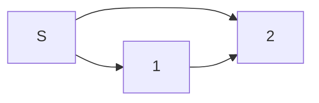

# algorithms

# Induction

Induction is one of our most powerful tools for proving things (e.g., correctness, runtime) about our algorithms, and it can be intimidating. To reduce the stress surrounding induction, we will present it as a step-by-step process you can follow when you don't know where to start or if you are stuck. With practice, you will understand the common patterns and become comfortable proving properties about the algorithms you develop.

Induction:
1. The claim. Before we prove something, we need a clear statement
about what we want to prove and what it means for an algorithm to be correct. Take sorting.
2. The induction target. What are we running induction on? The target is a variable that is an integer that can correspond to all possible inputs. In many cases, it will be the size of the input.
3. Base case.
4. The inductive hypothesis. This is the thing that we will assume to be true. It is an additional fact that we can use to prove our claim true. BE CAREFUL that your inductive hypothesis does not inadvertently assume your claim is true. This is a common mistake, and it is worth taking a second to look back at your claim to be sure there is room between this assumption and your claim.
5. The inductive step.

Claim: $2^n < n!$ $\forall n \geq 4$ 

Proof by induction on $n$.

Base case: When $n=4$ $2^4=16$ which is less than $4!i = 24$.

Inductive hypothesis: Assume that $2^(n-1) < (n-1)!$. 

Inductive step: If $2^(n-1) < (n-1)!$ then $2^n < n!$
1. Let $n>4$
2. $2^n = 2 * 2^(n-1)$
3. From the inductive hypothesis, we know that $2^(n-1) < (n-1)!$, which implies that $2^n < 2 * (n-1)!$
4. Since we let $n>4$, $2^n < n * (n-1)!$
5. Since $n! =  n * (n-1)!$ we can reduce (4) to $2^n < n!$

By induction on $n$, $2^n < n!$ $\forall n \geq 4$

# Graph Search

